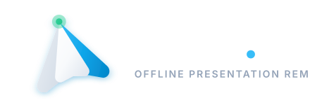

<div align="center">

# Glide

### Offline Presentation Remote Controller — Desktop + Mobile

[](https://tauri.app/)
[](https://www.rust-lang.org/)
[](https://vitejs.dev/)
[](https://flutter.dev/)
[](https://www.microsoft.com/windows)
[](https://opensource.org/licenses/MIT)

<br/>



<p align="center">
  <b>Glide</b> turns your phone into a luxurious presentation remote for Windows.<br/>
  Control your deck with a wireless touchpad, laser pointer, media keys, and more —<br/>
  over <b>Wi-Fi (QR pairing)</b> or <b>Bluetooth Classic</b>, fully offline and private.
</p>

</div>

---

## Key Features

- **Fully Offline & Private:** Peer-to-peer connection between your laptop and phone. No cloud, no accounts, no data ever leaves your devices.
- **Two Wireless Transports:**
  - **Wi-Fi (QR Pairing):** Scan a QR code on your laptop to auto-connect over WebSocket. Runtime-random per-session auth token keeps unauthorized devices out.
  - **Bluetooth Classic (SPP):** Pair directly for offline use with a 6-digit code — no network, no router needed.
- **Wireless Touchpad:** Full two-finger scroll, three-finger navigation, and smooth cursor control for the desktop.
- **Laser Pointer Overlay:** A highlighter drawn on your laptop screen, GPU-lightweight with an HTML5 canvas overlay.
- **Slide Precision Controls:** Clean NEXT / PREV buttons plus a media-deck — Volume, Mute, Play/Pause, and media skip.
- **Gyroscope-Assisted Laser (optional):** Tilt your phone to move the pointer, driven by the device's motion sensors.
- **Always-On Indicator:** Live latency (ms) and connection-quality label so you always know your link is healthy.
- **Persistent Settings:** Touch sensitivity, gyro sensitivity, spotlight mode and laser mode are saved between launches.
- **Polished Mobile UX:** Minimalist Indonesian-first interface with a redesigned gesture guide, theme transitions, and haptic feedback.

---

## Quick Start

### Prerequisites

| Component | Requirement |
| :--- | :--- |
| **Desktop (Windows)** | Windows 10/11 (64-bit), Node.js 18+ with `npm`, Rust (`rustc` + `cargo`) |
| **Mobile (Android)** | Flutter SDK 3.24+, Android device or emulator (minSdk 26) |
| **Mobile (iOS/macOS)** | Not currently targeted — Bluetooth + media controls are Android-first. |

### 1. Clone Repository

```bash
git clone https://github.com/syans-OG/Glide.git
cd Glide
```

### 2. Run the Desktop App

```bash
cd desktop
npm install
npm run tauri dev      # development build with live reload
```

### 3. Build the Desktop Installer

```bash
npm run tauri build
```

### 4. Run the Mobile App

```bash
cd mobile
flutter pub get
flutter run             # connect an Android device first
```

### 5. Connect

1. Launch **Glide** on your Windows laptop and pick a tab:
   - **Wi-Fi:** a QR code appears — scan it with the phone's Glide app (or enter the IP + session token manually).
   - **Bluetooth:** enable pairing on the laptop, then tap the device name in the Android app.
2. The phone becomes a remote. Use the touchpad to move the cursor, tap **Laser** to aim with your scroll position or tilting the phone, and hit **NEXT** / **PREV** to advance your slide.

---

## Architecture and Tech Stack

```
Glide/
├── desktop/                    # Tauri 2 (Rust) Windows app
│   ├── src-tauri/
│   │   ├── src/
│   │   │   ├── main.rs        # Entrypoint
│   │   │   ├── lib.rs         # App state, commands, session token
│   │   │   ├── server.rs      # WebSocket server + auth handshake
│   │   │   ├── transport.rs   # Transport abstraction (WS + BT)
│   │   │   ├── bluetooth.rs   # WinRT RFCOMM SPP server (Classic)
│   │   │   ├── input.rs       # Win32 cursor & keystroke simulation
│   │   │   └── capabilities/  # Least-privilege permissions
│   │   ├── tauri.conf.json    # Build config, CSP
│   │   └── Cargo.toml
│   ├── src/                    # Vanilla HTML/CSS/JS frontend
│   │   ├── index.html         # Main window (QR / status / controls)
│   │   ├── overlay.html       # Canvas laser & annotation overlay
│   │   ├── main.js
│   │   └── overlay.js         # requestAnimationFrame laser loop
│   └── public/logo_official.svg
│
└── mobile/                     # Flutter Android app
    └── lib/
        ├── main.dart          # Entrypoint + animated theme switch
        ├── services/
        │   ├── connection_service.dart # WS + BT routing
        │   ├── bluetooth_service.dart  # RFCOMM client
        │   └── settings_service.dart   # SharedPreferences persistence
        └── ui/
            ├── pairing_screen.dart     # QR / manual / Bluetooth tabs
            ├── controller_screen.dart  # Main remote surface
            └── widgets/                 # touchpad, deck, sheets, header
```

---

## How It Works

When the desktop app starts, it generates a **random session token**, opens a WebSocket server, and either displays a QR code or a Bluetooth pairing code. The phone must present the correct token in its first message; the server rejects anything else. All messages are lightweight, line-framed JSON — commands like slide change or cursor move are applied locally via Win32 APIs and a canvas overlay, so there is no perceptible lag across a home or office network.

---

## Visual Identity and Brand System

| Mark | File | Preview |
| :--- | :--- | :---: |
| **Wordmark** | [`glide-wordmark.svg`](./glide-wordmark.svg) | Origami aero glider with a laser beacon + "Glide." lockup |
| **App & Tray Icon** | [`logo_official.svg`](./desktop/public/logo_official.svg) | Squircle icon — clean silicon billet glider on a deep OLED gradient |

---

## License

Distributed under the **MIT License**. See `LICENSE` for more information.

---

<div align="center">
  Crafted for distraction-free presenting.
</div>
